Na diversidade que existe no mundo GNU/Linux, existem dois boot managers que nos lembramos logo: LILO e o GRUB. O _LILO_ (**LI**nux **LO**ader) é um dos mais antigos (ou pelo menos na comparação entre estes dois) e vem por padrão em muitas distribuições. Com a evolução da tecnologia ainda foi desenvolvido uma versão do LILO para sistemas UEFI, contudo, o projeto LILO foi descontinuado em 2015. Contudo, o ELILO ainda é bastante usado e poder-se-á encontrar em algumas distribuições, como é o caso do Slackware.

No outro lado, temos o GRUB (que significa **GR**and **U**nified **B**ootloader) que é um projeto sobe a alçada _GNU PROJECT_. Tal como o anterior, permite multiboot (iniciar vários sistemas operativos que estejam instalados no sistema) e é o mais utilizado nos dias de hoje. Sim, também permite a inicialização de sistemas UEFI e, uma das principais vantagens em relação ao anterior, o GRUB permite utilizar uma palavra passe para continuar o boot, ou seja, tem um factor de segurança adicional que o LILO não tem (ou pelo menos, e até à data da escrita deste artigo, eu desconheço - Irei pesquisar e se estiver errado, faço a correção).

Partindo da frase "o Slackware é antigo" venho desmistificar esse mito ao mostrar que podemos ter no nosso sistema, tanto o ELILO (caso seja utilizado UEFI) como o GRUB, para isso basta seguir os passos abaixo. De salientar que os comandos aqui mostrados foram testados em várias máquinas com diferentes tipo de instalação e uso, no entanto recomendo, caso seja do seu interesse, a leitura à posterori das ações de cada comando.

 

## Instalação

A instalação do GRUB no Slackware (neste teste irei utilizar a versão _current_) é bastante simples e pode ser feita em dois momentos distintos. Vamos então ver:

### 1) Instalação nova do sistema

Caso pretenda instalar o GRUB em vez do ELILO, faça o seguinte: Durante a instalação, quando surgir a caixa de diálogo se pretende instalar o _LILO_ selecione _skip_

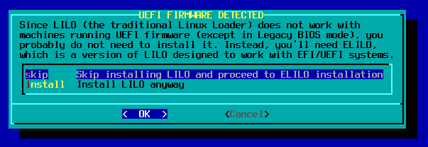

Aqui, novamente selecionar _skip_ para o sistema não instalar o ELILO.

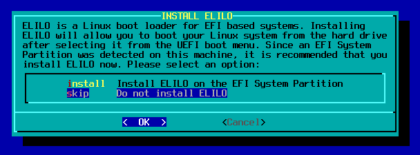

Depois é prosseguir com a instalação até ao final (até aparecer este screen)

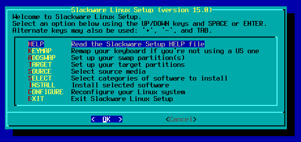

aqui selecione a opção _Exit_, faça OK e, **muito importante** (é aqui o chamado _"pulo do gato"_) seleccione a primeira opção, _"Shell"_.

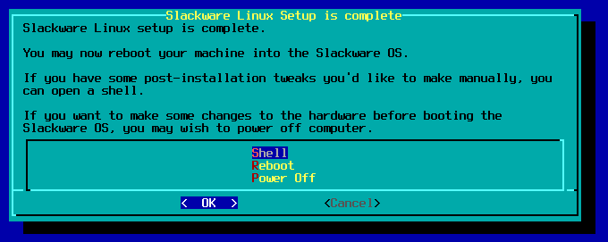

Agora sim, vamos instalar o GRUB no sistema. O primeiro passo é montar a partição _/mnt_ como chroot:

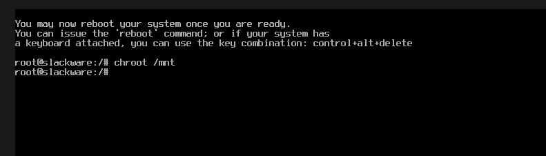

Se não houver erro nenhum, este primeiro passo está dado. Agora iremos instalar o GRUB na partição de boot do sistema (geralmente (numa instalação padrão) é no _sda_, se não for o seu caso, reveja a sua tabela de partições com o comando _**df**_ ). _**ATENÇÃO** se se enganar neste passo compromete todo o seu sistema e acabará por reformatar o mesmo, não será grande problema visto ser uma instalação de raíz, no entanto, na próxima forma de instalar pode ser complicado_.

O Comando para instalar é:

> grub-install /dev/sda

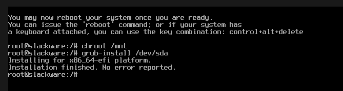

Estamos já bem perto do final, basta apenas um comando! O próximo passo é gerar um ficheiro de configuração (geralmente com a extensão _.cfg_) para que o bootload possa "ler" e entender o que tem que fazer. Executemos o comando:

> grub-mkconfig -o /boot/grub/grub.cfg

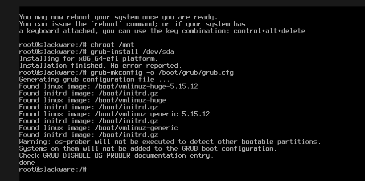

Neste comando, ao chamar o executável _grub-mkconfig_ utilizamos o parametro _-o_ (que significa _output_) para definir onde queremos guardar o ficheiro de configuração (neste caso fica na diretoria _/boot/grub_). Quando é executado, o sistema procura pelos Kernel existentes na máquina e adiciona-os de modo a ser opções de escolha quando o sistema iniciar. Após esta verificação, é gerado o ficheiro e armazenado na diretoria.

Feito isto fazemos _exit_ para sair do chroot e por fim, _reboot_ para reiniciar a máquina. Feito!

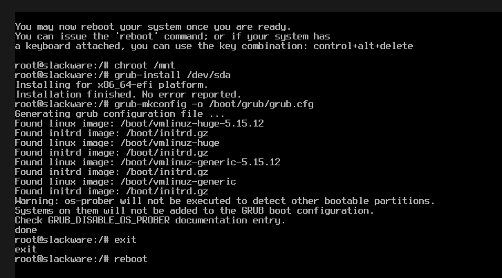

 

### 2) Após instalação do sistema

Substituir o ELILO (ou LILO caso seja um sistema sem UEFI) é relativamente simples. Para começar, quando o sistema terminar o boot e estiver pronto para fazer login com o seu utilizador, troque a interface gráfica pelo modo de texto através da combinação **CTRL+ALT+F2**. Quando pedir o login, faço-o como root

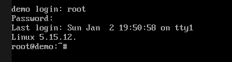

Após login, repetimos esta sequência de comandos que foram também utilizados pelo método anterior (_novamente deixar a mesma nota que é necessário (re)ver qual partição está o boot para não comprometer o sistema_):

> grub-install /dev/sda
>
> grub-mkconfig -o /boot/grub/grub.cfg

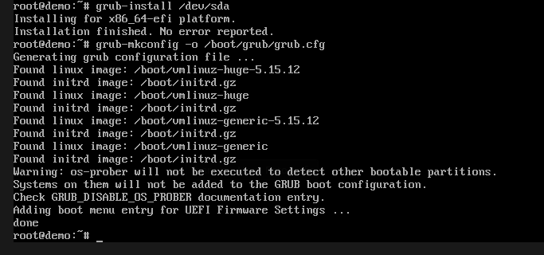

Grub instalado com sucesso! Mas ainda não está tudo! Para evitar problemas, vamos remover o (E)LILO que foi instalado durante a instalação do sistema. Para isso basta executar:

> slackpkg remove lilo elilo

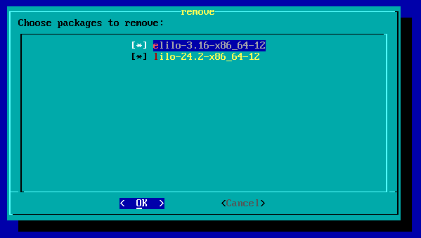

Confirmamos a nossa escolha e aguardamos que termine. O último passo é reiniciar e... Feito! O GRUB está instalado e pronto a ser utilizado.

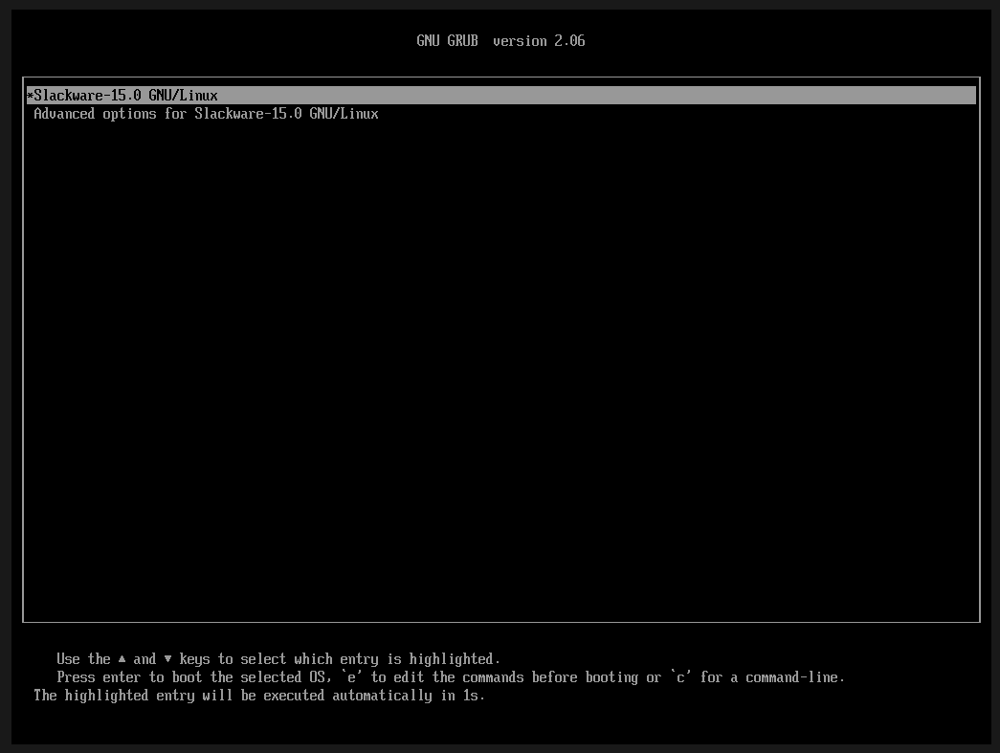

  

## Atualizações

Após cada atualização do kernel, é necessário gerar um novo ficheiro de configuração do Grub, caso contrário o sistema não irá iniciar corretamente, fazendo com que tenha que realizar passos adicionais para voltar a ter o sistema a funcionarem pleno. Assim, por cada update, basta fazer o seguinte comando:

> grub-mkconfig -o /boot/grub/grub.cfg

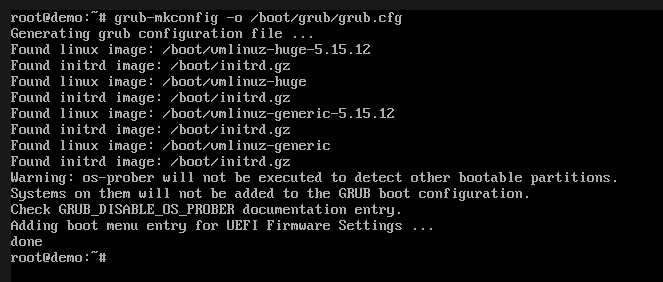

Se surgir a mensagem que pretende substituir o ficheiro existente, basta dizer que _sim_ e o sistema trata do resto.

 

## Vídeo

Como diz o ditado "_uma imagem vale mais que mil palavras_", abaixo deixo o vídeo deste post que coloquei no canal do youtube.
<video>