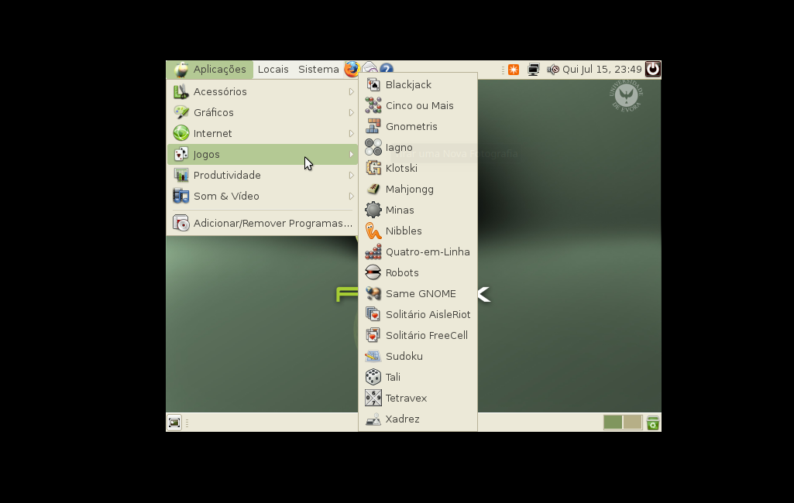

# Somewhere in Time...
Após seguir uns quantos blogs sobre tecnologia (com alguma ênfase ao Linux) e outros tantos canais no youtube, surgiu a ideia de iniciar uma rúbrica aqui no cantinho denominado de "*Somewhere in Time...*" onde pretendo revisitar algumas distribuições que, por algum motivo, acabaram por não ser mais mantidas e o projeto acabando por ser descontinuado.

Na impossibilidade de testar em máquina física, irei fazer uma instalação em máquina virtual, não só para (re)ver todo o processo de instalação, como também para ver as ferramentas e definições do sistema.

 

## Alinex
No post de hoje trago uma distribuição portuguesa desenvolvida em parceria entre a Universidade de Évora e a Junta da Extremadura (Espanha). Segundo a equipa de desenvolvimento, a "versão desktop do Alinex foi desenvolvida a pensar nas necessidades dos utilizadores comuns", ou seja, uma distribuição que podia ser usada tanto a nível empresarial como a nível doméstico (seja ele em desktop ou portátil).

A distribuição foi criada em 2005 através de um protocolo entre a Universidade de Évora e a Junta da Extremadura (Espanha), sendo a versão inicial derivada de uma distribuição da Extremadura Espanhola (por sua vez era derivada de Debian). A partir da versão 2, foi então baseada no Ubuntu. Como ambas as regiões são próximas, o logotipo (ou poder-se-á chamar a mascote) é um animal bastante característico da região, a ovelha!

Tal como foi referido, o **Alinex** visava vários públicos, nomeadamente PME (Pequenas e Médias Empresas), sector público (Administração Pública), sector educativo (como escolas (de todos os ensinos, desde o básico ao universitário - não fosse esta uma distribuição desenvolvida por uma Universidade), bibliotecas), utilizador comum e até à indústria (seja ela de que ramo for).

O **Alinex** tem a sua última release datada de 25 Fevereiro de 2010, com a build *3.9.10*. Contudo, na minha pesquisa pela ‘internet’ fora, só consegui encontrar a versão 2.0 para download, versão essa que irei testar já a seguir.

 

## Instalação
Após o arranque do CD (neste caso da imagem *.iso* na máquina virtual), o menu ainda é bastante comum nos dias de hoje, onde se permite inicializar o instalador da distribuição, iniciar o modo de LiveCD (experimentar sem instalar no computador), executar a ferramenta *MemTest* (permite fazer um teste às memórias RAM) e por fim, iniciar o computador pelo sistema operativo instalado no disco rígido.

Neste caso, embora a imagem indique o contrário, escolhi a primeira opção para iniciar o Alinex em LiveCD.

O boot é até bastante rápido e "*clean*" o que faz com que, mesmo em computadores modestos, esta distribuição era para ter em conta e uma opção bastante válida. Após o carregamento do boot, eis que surge o ecrã principal:

Não posso deixar uma nota em relação à resolução de ecrã. Tentei aumentar a mesma, mas o qemu (ferramenta que usei para virtualizar o sistema para este post) não me deixou alterar, ficando com uma resolução bastante baixa na ordem dos 640x480 (ou algo muito idêntico).

Sem mais, segue algumas imagens do instalador:

A própria instalação também é bastante rápida, simples e directa, tal como era a instalação do Debian 5 (talvez traga numa das próximas crónicas). Bem perto do fim da instalação a mesma parou quando tentava aceder à internet para descarregar packages da distribuição. Por momentos até pensei que ainda fosse possível (sonhar não custa), mas rápidamente percebi que ou clicava no botão de ignorar para continuar a instalação, ou ficava ali parado.

Findo este impasse, a instalação fica concluída e podemos optar entre dois caminhos:
* Ou continuamos a explorar o LiveCD
* Ou reiniciamos a máquina e vamos utilizar o sistema acabado de instalar

Com estas duas opções a escolha mais óbvia foi a segunda. Vamos reniciar e já continuamos!

 

## Instalação feita. E agora?
Instalação concluída, reboot feito, vamos então explorar o sistema! Para começar, vamos ver tão antigo é o kernel do sistema:

Versão *2.6.x*, bem antigo! Vamos então passar ao software instalado:

Como era de se esperar, o firefox consegue aceder ao blog, mas... Fica completamente desconfigurado! Ao menos a internet funciona (e a placa de rede igual).

Por falar em rede, vamos ver se conseguimos aceder à actualziação do sistema:

Bom sinal! Temos updates! Será que instala? Vamos ver...

E... Nada! Já era previsto, mas mesmo assim, nada como tentar!

Mas pronto, vamos continuar:

Como podemos ver, o Alinex vinha com um bom equilibrio, não vinha sem software, e também não trazia software em abundância, podemos dizer que tinha um (e excelente) software para cada tarefa que o utilizador fosse realizar.

Tal como no exemplo do Firefox, todas as versões apresentadas datam de 2007, logo o aspecto visual das mesmas era meio... tosco! Contudo, como o Linux é bastante personalizável (e já o era neste tempo) e isso permitia uma panóplia de configurações tornando o sistema único, bem de acordo com os gostos pessoais do utilizador.

Os comandos de sistema, como ver memória utilizada, espaço ocupado, gestão de utilizadores, permissões a ficheiros e pastas (e demais comandos) são precisamente os mesmos.

   

## Conclusões
Tal como seria expectável, muitas memórias vieram "ao de cima" após a instalação do **Alinex**. Remeteu-me para os tempos em que a internet ainda era meio escassa e que a informação era fornecida através de foruns da comunidade, por outros utilizadores que, por sinal, eram alunos (ou até mesmo professores) da Universidade de Évora e por artigos escritos em blogs e revistas da especialidade.

A par destas memórias, todo este sistema (nos dias de hoje) mostra um Gnome, ainda que na sua versão 2, na sua plenitude, com as suas cores características (e quiçã até os bugs). O instalador é ligeiramente diferente do instalador atual do Debian (algumas secções mudaram, outras apenas sofreram ajustes ou visuais ou em termos de acessibilidade).

Vem com algum software instalado por default, bastante comum na época, uma vez que a internet ADSL ainda estava a começar a sua caminhada por velocidades mais altas. O sistema, tal como foi referido, acusa updates, mas como era de se esperar, após tantos anos, os servidores já não estão ativos.

Os testes foram feitos numa máquina virtual pelo que o desempenho pode não corresponder 100% ao real, isto é, a distribuição quando instalada numa máquina física, o desempenho é ajustado às características da mesma, logo a fluídez é outra e a experiência de se utilizar é alterada... Para melhor.

Obrigado desde já o tempo dispensado a ler mais um post. Espero que tenham gostado, tanto (ou mais) quanto eu.

   

## Vídeo
Está a ser preparado um vídeo onde pretendo demonstrar o que foi escrito na prática (instalação, software, etc). Será tudo em tempo real sem cortes e sem edição, a velocidade do hardware ditará o tamanho do vídeo.
